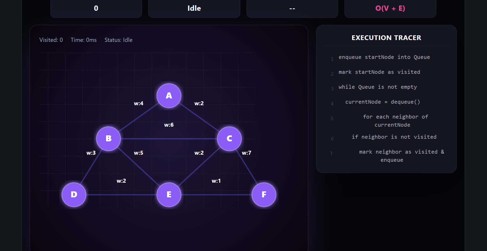
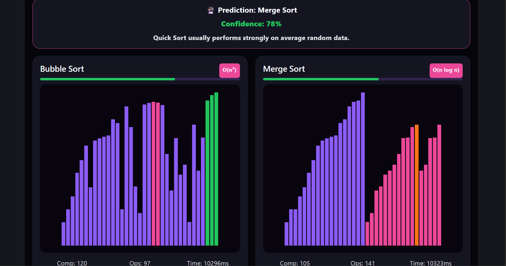
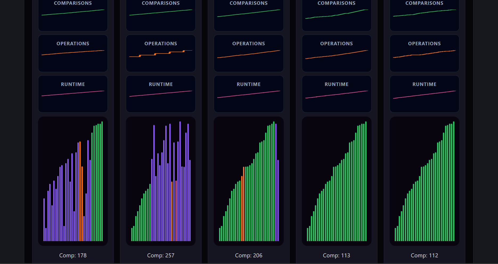

# SortSphereX

Interactive Sorting, Searching & Graph Algorithm Visualization Laboratory

## Features

- Interactive Sorting Visualizer
  - Bubble Sort
  - Selection Sort
  - Insertion Sort
  - Merge Sort
  - Quick Sort

- Searching Algorithms
  - Linear Search
  - Binary Search

- Graph Algorithms
  - BFS
  - DFS
  - Dijkstra's Algorithm
  - A* Pathfinding

- Compare Mode
  - Run algorithms side-by-side
  - Performance comparison

- Arena Mode
  - Competitive algorithm challenges
  - Real-time execution tracking

- Challenge Mode
  - Solve algorithm tasks
  - Test understanding interactively

- Execution Tracer
  - Line-by-line algorithm visualization

- Performance Metrics
  - Comparisons
  - Operations
  - Execution Time
  - Time Complexity

## Screenshots

### Home Dashboard

### Graph Visualizer

### Compare Mode

### Arena Mode

## Tech Stack

- React
- JavaScript
- Vite
- CSS

## Live Demo

[Add your Vercel URL here]

## Author

Ayush Kumar Mahapatra